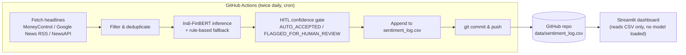

# Indi-FinBERT

A financial sentiment analysis pipeline and interactive dashboard for the Indian stock market, built around a custom fine-tuned FinBERT model ([aryanchauhan08/Indi-FinBERT](https://huggingface.co/aryanchauhan08/Indi-FinBERT)). The system scrapes and scores live financial headlines for Nifty-listed tickers twice a day, gates predictions through a human-in-the-loop confidence threshold, and visualizes results in an interactive Streamlit dashboard.

---

## Why it's built this way

The pipeline and the dashboard are intentionally decoupled into two separate environments:

- **Backend (GitHub Actions):** fetches news, runs the actual ML model, and commits results to a CSV ledger.
- **Frontend (Streamlit Community Cloud):** a lightweight, read-only dashboard that only reads the committed CSV and visualizes it.

This split exists because Streamlit Community Cloud's free tier caps apps at roughly 1 GB of RAM — nowhere near enough to hold a BERT-sized model in memory. Keeping heavy ML dependencies (`torch`, `transformers`) out of the dashboard's own requirements file is what keeps the deployed app stable.



---

## Features

- **Automated news ingestion** — scrapes MoneyControl, Google News RSS, and (optionally) NewsAPI for headlines matched against a Nifty-50-style ticker list, filtered for India-market relevance and quality.
- **Sentiment scoring** — runs headlines through a fine-tuned FinBERT model ([aryanchauhan08/Indi-FinBERT](https://huggingface.co/aryanchauhan08/Indi-FinBERT)), with a rule-based keyword fallback if the model is unavailable.
- **Source credibility weighting** — confidence scores are weighted by source (e.g. MoneyControl vs. an unverified wire service) before being logged.
- **Human-in-the-loop gating** — predictions below a configurable confidence threshold (default `0.65`) are flagged `FLAGGED_FOR_HUMAN_REVIEW` instead of being auto-accepted, supporting active-learning-style review of model blind spots.
- **Market Sentiment Index (MSI)** — a confidence-weighted, 7-day rolling net sentiment score (0–100, centered at 50), computed as positive confidence minus negative confidence, normalized by total confidence-weighted volume.
- **Engine / data lineage tracking** — every row records whether it came from the fine-tuned model or the rule-based fallback, so pipeline health can be monitored directly from the data.
- **Interactive dashboard** with three views:
  - **Live Pipeline** — MSI gauge, automation-rate KPIs, and a filterable table of today's gated headlines with HITL decisions.
  - **Sentiment Engine** — an ad-hoc single-headline analyzer and batch CSV scorer, with LIME and Integrated Gradients (via `transformers-interpret`) explainability, plus a side-by-side comparison against vanilla `ProsusAI/finbert`.
  - **Gating Signals** — a live per-ticker feed with a rolling sentiment donut chart and NSE/BSE price context via `yfinance`.
- **Resilient data loading** — the dashboard falls back from the GitHub-hosted CSV → a local cached copy → generated mock data, with visible warnings if it ever has to fall back.

---

## Tech stack

| Layer | Tools |
|---|---|
| Model | Hugging Face `transformers`, custom fine-tuned FinBERT ([aryanchauhan08/Indi-FinBERT](https://huggingface.co/aryanchauhan08/Indi-FinBERT)) |
| Explainability | `lime`, `transformers-interpret` |
| Scraping | `requests`, `BeautifulSoup`, `feedparser` (Google News RSS) |
| Pipeline orchestration | GitHub Actions (scheduled cron + manual dispatch) |
| Dashboard | Streamlit, Plotly, Pandas |
| Market data | `yfinance` |

---

## Repository structure

```
.
├── app.py                      # Streamlit dashboard (frontend, read-only)
├── live_inference.py           # News fetch + inference pipeline (backend)
├── config.py                   # Ticker list, keywords, thresholds, credibility weights
├── requirements.txt            # Frontend dependencies only (Streamlit Cloud)
├── requirements-backend.txt    # Backend dependencies (transformers, torch, lime, etc.)
├── .github/workflows/
│   └── daily_inference.yml     # GitHub Actions cron job
└── data/
    └── sentiment_log.csv       # Append-only sentiment ledger, committed by the pipeline
```

---

## Getting started locally

### 1. Clone and install dependencies

To run the **dashboard only**:

```bash
pip install -r requirements.txt
streamlit run app.py
```

To run the **ingestion pipeline** (requires the heavier ML stack):

```bash
pip install -r requirements-backend.txt
python live_inference.py
```

### 2. Set required secrets / environment variables

Create a `.env` file (used locally via `python-dotenv`) or export these directly:

| Variable | Required for | Notes |
|---|---|---|
| `HF_TOKEN` | Both frontend and backend | Hugging Face access token for the `aryanchauhan08/Indi-FinBERT` model |
| `NEWS_API_KEY` | Backend (optional) | Enables the NewsAPI source; pipeline runs fine without it, using MoneyControl + Google News RSS only |

### 3. (Optional) Enable the local pipeline-trigger button in the dashboard

The **Run Live Inference Pipeline** button is disabled by default in the deployed app (it only makes sense for local testing, since it can't push results back to GitHub). To re-enable it locally:

```bash
export ENABLE_LOCAL_PIPELINE_TRIGGER=true
streamlit run app.py
```

---

## Deployment

**Dashboard:** deployed via [Streamlit Community Cloud](https://streamlit.io/cloud), pointed at `app.py`. Uses `requirements.txt` only — the heavy ML/scraping dependencies in `requirements-backend.txt` are intentionally never installed in this environment.

**Pipeline:** runs automatically via the GitHub Actions workflow in `.github/workflows/daily_inference.yml`, on a schedule of **05:47 IST** (pre-market) and **16:00 IST** (post-market), Mon–Fri, plus on-demand via `workflow_dispatch`. Requires `HF_TOKEN` and `NEWS_API_KEY` configured as repository secrets (**Settings → Secrets and variables → Actions**).

---

## How the sentiment pipeline works

1. **Fetch** — headlines are pulled from MoneyControl (front-page scrape), Google News RSS (per-ticker search), and optionally NewsAPI, then filtered for length, relevance, and India-market signal words, and deduplicated via MD5 hashing.
2. **Predict** — each headline is scored by the fine-tuned Indi-FinBERT model (or a keyword-based rule fallback if the model can't be loaded), then the raw confidence is weighted by the source's configured credibility factor.
3. **Gate** — if the weighted confidence is at or above the threshold (`CONFIDENCE_THRESHOLD` in `config.py`, default `0.65`), the row is marked `AUTO_ACCEPTED`; otherwise it's `FLAGGED_FOR_HUMAN_REVIEW`.
4. **Log** — the row is appended to `data/sentiment_log.csv` along with which engine produced it, and the pipeline commits and pushes the updated file.
5. **Visualize** — the dashboard reads the committed CSV, computes the rolling MSI and per-ticker breakdowns, and renders everything without ever loading a model itself.

---

## Known limitations

This is a student-level project, and a few known rough edges are left as-is rather than engineered further:

- **Cross-day deduplication scope** — the dashboard deduplicates headlines by `(Ticker, Headline)` across the entire CSV history, not per-day. A headline with identical text to one logged on an earlier date (e.g. a recurring analyst-recommendation headline) will be dropped from a given day's count even though it's a genuinely new sighting.
- **Publish time vs. ingestion time** — the `Date` field records the ingestion timestamp uniformly across all sources. MoneyControl and Google News RSS do expose publish times, but normalizing to ingestion time avoids date-skew bugs when articles published the previous day are fetched in an early-morning run.
- **News source coverage varies run to run** — headline yield per run can vary significantly (single digits to 60+) depending on source rate limits and how many fetched headlines survive the relevance filters; this isn't currently monitored or alerted on.

---

## Acknowledgments

- Base sentiment comparison model: [ProsusAI/finbert](https://huggingface.co/ProsusAI/finbert)
- Built with [Streamlit](https://streamlit.io/), [Hugging Face Transformers](https://huggingface.co/docs/transformers/), and [Plotly](https://plotly.com/python/)
